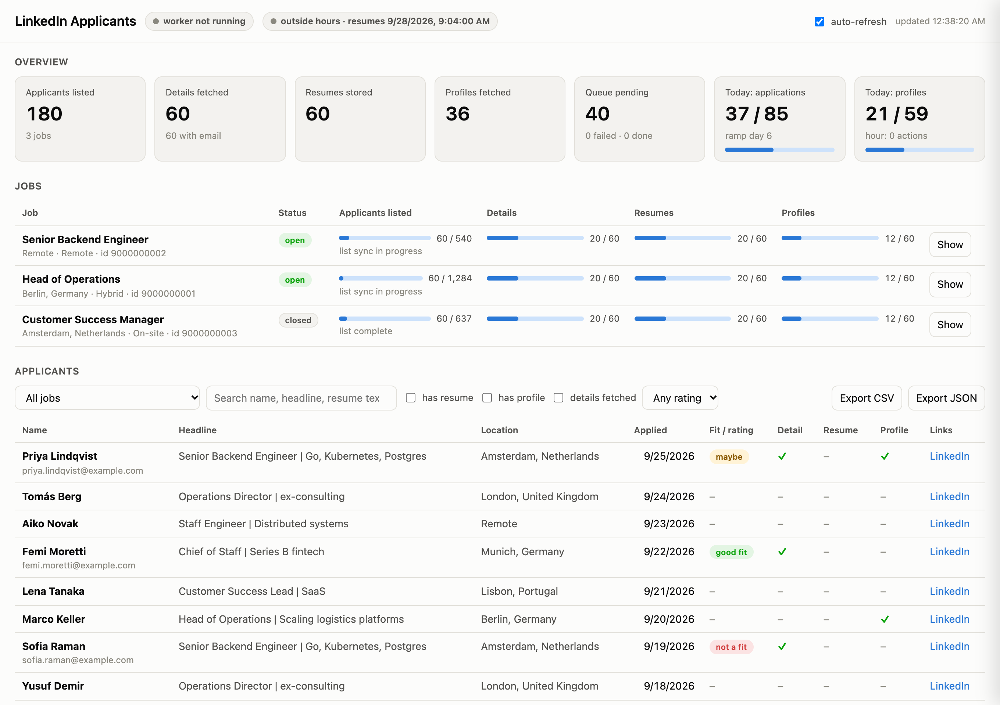

# linkedin-applicants-mcp

Export the applicants of your LinkedIn job posts (lists, application details, resume files and full profiles) through your own logged-in Chrome, paced like a person. Drive it from Claude, Codex, Cursor or any MCP client, browse and search the results in a local dashboard, and export them to CSV or JSON.

[](https://github.com/meskhetian/linkedin-applicants-mcp/actions/workflows/ci.yml)
[](LICENSE)
[](https://nodejs.org)
[](#compliance-and-privacy)

## What it does

`linkedin-applicants-mcp` is a [Model Context Protocol](https://modelcontextprotocol.io) server for LinkedIn **job posters**, company-page admins and hiring collaborators using the free hiring dashboard, not Recruiter seats. It drives your own installed Google Chrome, in a dedicated profile you sign in to once, through the dashboard you already have access to: posted jobs, applicant lists, each application (contact details, screening answers, rating, resume file) and the applicant's full LinkedIn profile. Everything lands in a local SQLite database and a folder of files that you query instantly from Claude, browse in a local dashboard, or export to CSV/JSON.

### Why it exists

- LinkedIn's job-poster dashboard has **no bulk export**: applications and resumes can only be opened one at a time.
- Popular postings collect **thousands of applicants** across open and closed jobs; downloading each resume by hand does not scale.
- Any burst of automation gets a LinkedIn **account restricted**. This server does the slow, careful thing instead: one visible tab, human-like input, working hours, daily caps that ramp up, random breaks, shuffled order, and a resumable queue that keeps going for as many days as a job needs.
- It is strictly **read-only** on LinkedIn: it never rates, shortlists, messages or connects with anyone.

> Automating LinkedIn is against its User Agreement. Read [Compliance and privacy](#compliance-and-privacy) before using this.

## Dashboard

```bash
npm run dashboard        # → http://127.0.0.1:4173
```

A local, read-mostly web page over the same SQLite database the MCP server and worker use. It shows:

- **Overview** tiles: jobs, applicants, details, resumes, profiles, applicants with an email; worker state and work-window pills; today's usage against the effective caps; auto-refresh.
- **Jobs** table with progress meters per job: applicants listed vs the total LinkedIn reports, details, resumes and profiles fetched, list-sync state.
- **Applicants** table with the same filters as `applicants_list` (job, full-text search, has resume / profile / details, rating), pagination, and links to the stored resume file, `profile.json` and the LinkedIn profile.
- A **detail drawer** per applicant: contact details, screening answers, qualifications, resume text, profile.
- **Export CSV / JSON** buttons (the only write the dashboard performs: files under `<data>/exports/`).
- **Recent worker events** (checkpoints, rate limits, cool-downs, failures).

It binds to `127.0.0.1` only, applicant data is personal information, serves GET requests only, and never touches LinkedIn. Change the port with `LINKEDIN_MCP_DASHBOARD_PORT`.



*The dashboard with sample data: overview tiles, per-job progress meters and the applicant table.*

## How it works

```
┌───────────────────────────┐   stdio (MCP)   ┌───────────────────────────────────┐
│ Claude Desktop /          │ ◄─────────────► │ MCP server  (node dist/index.js)  │
│ Claude Code  (MCP client) │                 │ 27 tools · review_applicants      │
└───────────────────────────┘                 └───────────────┬───────────────────┘
                                                 enqueue tasks │ read results
                                                               ▼
┌───────────────────────────┐   reads         ┌───────────────────────────────────┐
│ Local dashboard           │ ──────────────► │ SQLite  (node:sqlite)             │
│ http://127.0.0.1:4173     │                 │ jobs · applicants (+FTS5) · tasks │
└───────────────────────────┘                 │ counters · settings · events      │
                                              └───────────────┬───────────────────┘
                                                  claims tasks │ writes rows + files
                                                               ▼
                                              ┌───────────────────────────────────┐
                                              │ Background worker + scheduler     │
                                              │ in-process, or `npm run worker`   │
                                              │ work hours · caps · breaks · lock │
                                              └───────────────┬───────────────────┘
                                                               │ patchright
                                                               ▼
                                              ┌───────────────────────────────────┐
                                              │ Your Google Chrome                │
                                              │ dedicated profile · visible tab   │
                                              └───────────────┬───────────────────┘
                                                               │ https
                                                               ▼
                                              ┌───────────────────────────────────┐
                                              │ linkedin.com hiring dashboard     │
                                              │ posted jobs → applicants →        │
                                              │ applications → profiles           │
                                              └───────────────────────────────────┘
```

1. **Tools only enqueue.** Every tool that touches LinkedIn (`jobs_sync`, `applicants_sync`, `applicants_fetch_details`, `applicants_fetch_profiles`) writes tasks to SQLite and returns immediately; the background worker does the browsing. Tasks survive restarts, and the progress of a long applicant list is saved after every page.
2. **The scheduler decides when the worker may act:** inside working hours and days (start and end jittered every day), under the rolling hourly cap and the daily caps, and never during a break. Daily caps ramp up from a small day-1 value so a fresh setup does not start at full speed. An owner lock in the database makes sure only one process drives the browser.
3. **Input looks human.** Bézier mouse paths with occasional overshoot, uneven wheel scrolling with back-scrolls, variable typing rhythm, and clipped log-normal pauses (long right tail) after clicks, while "reading" a page, between applicants and between profiles. Same-priority tasks are shuffled and the worker occasionally drops by the feed.
4. **It stops when LinkedIn asks for a human.** Verification, CAPTCHA, "unusual activity" and login pages are detected from the URL and strong page-text signals. The task is requeued without burning an attempt, the queue is flagged `needsHuman`, and nothing runs until you solve the page in the Chrome window and call `queue_resume`. HTTP 429/999 back the queue off for hours; three unexpected failures in a row trigger a 20–40 minute cool-down.
5. **Both LinkedIn hiring dashboards are supported**, detected per job from the URL LinkedIn lands on. The classic Ember list (`/hiring/jobs/<id>/applicants/?r=<BUCKET>&sort_by=APPLIED_DATE&start=N`, 25 per page) is crawled per rating bucket, Unrated, Good fit, Maybe and the hidden Not a fit. The 2026 "Hiring Pro" server-driven UI (`/hiring/applicants/?jobId=<id>&rating=ALL&sort=DateApplied`, 25 per page) uses numbered page buttons, a `start=` offset in the URL and resume downloads that open a signed URL in a new tab. Both are sorted by applied date so pagination stays stable across days, and raw page snapshots are kept next to the data so parsers can be repaired offline after LinkedIn deploys.

## Quick start

### Requirements

| | |
| --- | --- |
| Node.js | >= 22.13 (tested on Node 26). SQLite comes from Node's built-in `node:sqlite`; no native build step. |
| Browser | Google Chrome installed. The server launches *your* Chrome and never downloads a browser. Edge and Chromium work via `LINKEDIN_MCP_CHROME_CHANNEL`. |
| LinkedIn | An account that posted the jobs, or was added as a hiring collaborator. |
| OS | macOS, Linux or Windows. |

### 1. Install

```bash
git clone https://github.com/meskhetian/linkedin-applicants-mcp.git
cd linkedin-applicants-mcp
npm install
npm run build
```

### 2. Sign in once

```bash
npm run login
```

Chrome opens with a dedicated profile (`~/.linkedin-applicants-mcp/chrome-profile`). Sign in to LinkedIn yourself in that window, nothing is ever typed on your behalf. Expect LinkedIn's new-device check (an email PIN) the first time. Cookies persist in that profile, so you will not need to do this again unless LinkedIn logs you out. You can also do this later from Claude with the `browser_open_login` tool.

### 3. Register the server

**Claude Desktop**, `~/Library/Application Support/Claude/claude_desktop_config.json` (macOS) or `%APPDATA%\Claude\claude_desktop_config.json` (Windows):

```json
{
  "mcpServers": {
    "linkedin-applicants": {
      "command": "node",
      "args": ["/ABSOLUTE/PATH/TO/linkedin-applicants-mcp/dist/index.js"],
      "env": {
        "LINKEDIN_MCP_DATA_DIR": "/Users/you/.linkedin-applicants-mcp"
      }
    }
  }
}
```

**Claude Code:**

```bash
claude mcp add linkedin-applicants \
  -e LINKEDIN_MCP_DATA_DIR="$HOME/.linkedin-applicants-mcp" \
  -- node /ABSOLUTE/PATH/TO/linkedin-applicants-mcp/dist/index.js
```

Add `--scope user` to make it available in every project. All other settings are optional environment variables (see [Configuration](#configuration)).

### Use with other MCP clients

The server speaks standard MCP over stdio, so any client that can launch a local command works. Every client needs the same three things: the command `node`, the absolute path to `dist/index.js`, and the `LINKEDIN_MCP_DATA_DIR` environment variable (optional; defaults to `~/.linkedin-applicants-mcp`). Replace `/ABSOLUTE/PATH/TO` and `/Users/you` below.

| Client | Where to put it |
| --- | --- |
| Claude Desktop | `claude_desktop_config.json`, see above |
| Claude Code | `claude mcp add ...`, see above |
| OpenAI Codex CLI | `~/.codex/config.toml`, or `codex mcp add linkedin-applicants -- node /ABSOLUTE/PATH/TO/linkedin-applicants-mcp/dist/index.js` |
| Cursor | `~/.cursor/mcp.json` (global) or `.cursor/mcp.json` in a project |
| Windsurf | `~/.codeium/windsurf/mcp_config.json` |
| VS Code (GitHub Copilot agent mode) | `.vscode/mcp.json` in a workspace, or the user-level `mcp.json` via "MCP: Open User Configuration" |
| Cline, Roo Code | MCP Servers panel, "Configure MCP Servers" (`cline_mcp_settings.json`) |
| Zed | `settings.json`, `context_servers` |
| Gemini CLI | `~/.gemini/settings.json`, `mcpServers` |
| Continue | `~/.continue/config.yaml`, `mcpServers` |
| JetBrains AI Assistant / Junie | Settings, Tools, AI Assistant, Model Context Protocol, add server as JSON |
| Anything else | If it accepts a stdio command: same command, args and env. If it only accepts remote HTTP servers (for example ChatGPT connectors), run a stdio-to-HTTP bridge such as `supergateway` or `mcp-remote` in front of `node dist/index.js` on your own machine. |

**Codex CLI** (`~/.codex/config.toml`):

```toml
[mcp_servers.linkedin-applicants]
command = "node"
args = ["/ABSOLUTE/PATH/TO/linkedin-applicants-mcp/dist/index.js"]

[mcp_servers.linkedin-applicants.env]
LINKEDIN_MCP_DATA_DIR = "/Users/you/.linkedin-applicants-mcp"
```

**Cursor, Windsurf, Cline, Roo Code, Gemini CLI, JetBrains** (the common `mcpServers` shape):

```json
{
  "mcpServers": {
    "linkedin-applicants": {
      "command": "node",
      "args": ["/ABSOLUTE/PATH/TO/linkedin-applicants-mcp/dist/index.js"],
      "env": { "LINKEDIN_MCP_DATA_DIR": "/Users/you/.linkedin-applicants-mcp" }
    }
  }
}
```

**VS Code** (`.vscode/mcp.json`):

```json
{
  "servers": {
    "linkedin-applicants": {
      "type": "stdio",
      "command": "node",
      "args": ["/ABSOLUTE/PATH/TO/linkedin-applicants-mcp/dist/index.js"],
      "env": { "LINKEDIN_MCP_DATA_DIR": "/Users/you/.linkedin-applicants-mcp" }
    }
  }
}
```

**Zed** (`settings.json`):

```json
{
  "context_servers": {
    "linkedin-applicants": {
      "source": "custom",
      "command": "node",
      "args": ["/ABSOLUTE/PATH/TO/linkedin-applicants-mcp/dist/index.js"],
      "env": { "LINKEDIN_MCP_DATA_DIR": "/Users/you/.linkedin-applicants-mcp" }
    }
  }
}
```

**Continue** (`~/.continue/config.yaml`):

```yaml
mcpServers:
  - name: linkedin-applicants
    command: node
    args:
      - /ABSOLUTE/PATH/TO/linkedin-applicants-mcp/dist/index.js
    env:
      LINKEDIN_MCP_DATA_DIR: /Users/you/.linkedin-applicants-mcp
```

**Test any setup without a client**: `npx @modelcontextprotocol/inspector node dist/index.js` opens the MCP Inspector, where you can call `browser_status` and `queue_status` by hand.

Two notes that apply to every client:

- Clients that start the server only while a chat is open also stop the embedded worker when they close it. For multi-day exports run the worker as its own process with `npm run worker` and set `LINKEDIN_MCP_AUTOSTART_WORKER=false` in the client config; the tools keep working, the queue keeps draining.
- Several clients may run their own server instance at the same time. That is fine: they share one database, and an owner lock guarantees only one process drives Chrome.

### 4. First workflow

| Step | Ask Claude to call | What happens |
| --- | --- | --- |
| 1 | `browser_status` | Is Chrome connected and LinkedIn logged in? If not, `browser_open_login`. |
| 2 | `jobs_sync` with `wait: true` | Crawls **Posted jobs**: the default tab plus every `jobState=` tab LinkedIn renders (Closed is always included). Blocks up to 2 minutes and returns the jobs. |
| 3 | `jobs_list` | Jobs stored locally with progress counters. Pick a `jobId`. |
| 4 | `applicants_sync` with `jobId` | Queues the applicant-list crawl: 25 per page, progress saved after every page, hidden "Not a fit" applicants included. |
| 5 | `applicants_fetch_details` with `jobId` | Queues, per applicant, the application page plus resume download and then the full profile (`includeProfile` defaults to true). Returns how many were queued and a day estimate. |
| 6 | `queue_status` | Poll it: task counts, today's usage vs caps, whether you are inside the work window, per-job list progress, any checkpoint LinkedIn raised. |
| 7 | `applicants_list`, `applicant_get`, `resume_text`, `applicants_export` | Read and export locally, instant, no LinkedIn traffic. Or run the `review_applicants` prompt with your criteria. |

Steps 2–5 only enqueue work; the worker does the browsing during working hours.

## Tools

### Session

| Tool | Description |
| --- | --- |
| `browser_status` | Is Chrome connected, is LinkedIn logged in, current URL, any checkpoint. Never launches a browser. |
| `browser_open_login` | Launches (or connects to) your Chrome with the dedicated profile and opens LinkedIn so *you* can sign in; waits up to `timeoutSeconds`. |
| `browser_close` | Stops the worker and closes the Chrome window the server launched (cdp mode: only disconnects). Queued tasks stay in the database. |

### Jobs

| Tool | Description |
| --- | --- |
| `jobs_sync` | Queue a crawl of `/my-items/posted-jobs/` (open and, by default, closed). `wait: true` blocks up to 2 minutes and returns the jobs. |
| `jobs_list` | Jobs stored locally with per-job counters: applicants stored, details fetched, resumes stored, profiles fetched, list-sync progress. |

### Applicants (LinkedIn work, queued)

| Tool | Description |
| --- | --- |
| `applicants_sync` | Crawl the applicant **list** of one job or `allJobs`: name, headline, location, applied date, application id, profile link. Runs in chunks of `pagesPerRun`, resumes across restarts; `restart` ignores saved progress. |
| `applicants_fetch_details` | Open each application page (email/phone when shared, screening answers, rating), download the resume, then optionally the full profile (`includeProfile`, `profileDepth`, `savePdf`). `onlyMissing` and `limit` control scope. |
| `applicants_fetch_profiles` | Full profiles only, for applicants whose profile URL is already known. The most rate-sensitive action on LinkedIn. |

### Data (local, instant)

| Tool | Description |
| --- | --- |
| `applicants_list` | Page through stored applicants with filters (`jobId`, `rating`, `hasResume`, `hasProfile`, `hasDetail`) and full-text search over name, headline, resume text and profile text (prefix matching). |
| `applicant_get` | The full local record of one applicant: list fields, application details, resume text (clipped to `maxChars`), structured profile. |
| `resume_text` | Plain text extracted from the downloaded resume (PDF/DOCX). Empty for scanned PDFs. |
| `applicants_export` | Stream all applicants (or one job) to CSV, JSON or JSONL on disk. CSV is Excel-friendly (UTF-8 BOM) and guards against formula injection. |

### Queue and pacing

| Tool | Description |
| --- | --- |
| `queue_status` | Worker state (running / paused / `needsHuman`), task counts, today's counters vs effective caps, work window and next window start, per-job list progress, browser status, recent events. |
| `queue_start` | Start or resume the worker in this process. No-op if another process (`npm run worker`) owns the queue. |
| `queue_pause` | Pause after the current task; tasks stay queued. |
| `queue_resume` | Clear the paused flag and, by default, the `needsHuman` flag; then start the worker. Call it after solving a checkpoint. |
| `queue_cancel` | Cancel pending tasks by `type`, `jobId` or `applicationId` (no filter cancels all pending). Done work is untouched. |
| `queue_retry_failed` | Put failed tasks back with a fresh attempt budget. |
| `queue_tasks` | Recent tasks with status, attempts and last error. |
| `pacing_get` | Current speed, working hours/days, caps, ramp, breaks, delay table. |
| `pacing_set` | Change any of those; persisted and wins over environment variables. Warns above ~100 profiles/day or ~60 actions/hour. |

### Debug (for when LinkedIn changes its markup)

These operate on the same single tab the worker uses, `queue_pause` first.

| Tool | Description |
| --- | --- |
| `debug_snapshot` | Save a full-page screenshot, the HTML, the visible text and all captured network payloads of the current tab into `<data>/debug/`. |
| `debug_navigate` | Navigate the tab to a `linkedin.com` URL the human way, then report URL, title and checkpoint state. Refuses other domains. |
| `debug_page_text` | The `innerText` of `<main>` (or body) of the current tab, clipped. |
| `debug_find` | Count and describe the elements matching a CSS/Playwright selector (text, href, aria-label, `data-view-name`, `componentkey`, class). |
| `debug_click` | Click the first visible match with the worker's paced mouse movement. Refuses selectors that look like a write action (rate, shortlist, message, reject, …). |
| `debug_captures` | The JSON/RSC responses LinkedIn's own web app fetched while browsing (Voyager REST, GraphQL, flagship-web), how you discover its internal endpoints. |

### Prompt

`review_applicants(jobId, criteria)`, pages through every stored applicant of a job, reads resume text, structured profile and screening answers with `applicant_get`, scores each 1–10 against your criteria, and returns a ranked Markdown table (rank, name, headline, location, score, strengths, gaps, `applicationId`, `profileUrl`) plus the list of applicants whose details are still missing. It works on local data only and is told not to contact anyone or invent facts.

## Pacing

Everything below is the `normal` speed. Slower is safer; the defaults mimic one recruiter reviewing applicants during office hours.

| Mechanism | Default | Adjust with `pacing_set` |
| --- | --- | --- |
| Working hours and days | 09:00–19:00 local time (or `timezone`), Mon–Fri, start/end jittered per day | `workHoursStart`, `workHoursEnd`, `workDays`, `timezone` |
| Daily cap: application pages | 120, **ramped**: 25 on day 1, +10 per day until the cap | `dailyApplicantCap`, `rampStart`, `rampPerDay` |
| Daily cap: full profile views | 80, ramped at 70 % of the applicant ramp | `dailyProfileCap` |
| Hourly cap: LinkedIn page actions | 40 per rolling hour | `hourlyActionCap` |
| Long breaks | every 25–60 actions, 5–20 minutes |, |
| Order | same-priority tasks shuffled; 8 % chance of a warm-up visit to the feed | `randomizeOrder`, `warmupProbability` |
| LinkedIn "Save to PDF" | at most 150 profiles per month (LinkedIn's own limit is 200) | `LINKEDIN_MCP_SAVE_PDF_MONTHLY_CAP` |

The `speed` preset scales the three caps (`slow` × 0.6, `brisk` × 1.4) and picks a delay table. Medians of the clipped log-normal pauses:

| Pause | `slow` | `normal` | `brisk` |
| --- | --- | --- | --- |
| After a click | 3 s | 2 s | 1.2 s |
| Reading a page | 18 s | 11 s | 6 s |
| Between list pages | 25 s | 15 s | 8 s |
| Between applicants | 90 s | 55 s | 25 s |
| Between profiles | 120 s | 75 s | 40 s |

**Expected throughput** at `normal`, once ramped: roughly 80–120 application pages and 60–80 profiles per work day. A job with 2,000 applicants is ~80 list pages (a few hours inside working hours), then ~17 work days of application pages and ~25 work days of profiles running interleaved, about five work weeks plus the ramp. If you need it faster, add work days or hours before raising caps, and never raise `dailyProfileCap` much above 100.

**Start slow after a new-device login.** The first sign-in to the dedicated profile looks like a new device to LinkedIn (expect an email PIN). Do not start a crawl the same evening. Begin the next work day with `jobs_sync` and a small `applicants_sync`, consider `LINKEDIN_MCP_SPEED=slow` with a gentler ramp (for example `LINKEDIN_MCP_RAMP_START=15`, `LINKEDIN_MCP_RAMP_PER_DAY=8`) for the first week, and only then move to `normal`.

**Profile strategy.** Profile views are the most rate-sensitive action on LinkedIn. With `LINKEDIN_MCP_PROFILE_STRATEGY=auto` (default) the worker visits the profile page like a person and then makes one request (1–3 with top-ups for truncated sections) to LinkedIn's internal profile API from inside the page, structured data with dates, instead of ~8 page views through the detail sections, and falls back to the rendered text if that fails. `dom` never touches the API and reads the profile and detail pages as text, at the cost of more page views per applicant. `voyager` uses the API only and fails if LinkedIn retires the endpoint.

## Data layout

```
~/.linkedin-applicants-mcp/                (LINKEDIN_MCP_DATA_DIR)
  db.sqlite                     jobs, applicants (+ resume/profile text, FTS5 index), tasks, counters, settings, events
  chrome-profile/               the dedicated Chrome profile, your LinkedIn cookies live here
  downloads/                    Chrome's download staging directory
  files/jobs/<jobId>/
    raw/                        raw applicant-list pages + the JSON LinkedIn's own app fetched
    <applicationId>_<Name>/     resume.<pdf|docx>, profile.json, profile.png, raw-application.json,
                                raw-voyager.json or raw-profile-*.json, profile-linkedin.pdf (savePdf)
  exports/                      CSV / JSON / JSONL exports
  debug/                        debug_snapshot output; every captured payload when LINKEDIN_MCP_CAPTURE_RAW=true
  logs/                         JSON-lines logs (stderr is mirrored here)
```

Resume text is extracted from PDF (unpdf) and DOCX (mammoth) and indexed for full-text search; the original file is always kept.

## Configuration

All settings are environment variables (see [.env.example](.env.example)). Pacing values can also be changed at runtime with `pacing_set`; persisted overrides win over the environment.

| Variable | Default | Meaning |
| --- | --- | --- |
| `LINKEDIN_MCP_DATA_DIR` | `~/.linkedin-applicants-mcp` | Data directory (database, Chrome profile, files, exports, logs) |
| `LINKEDIN_MCP_BROWSER_MODE` | `persistent` | `persistent` or `cdp` (see below) |
| `LINKEDIN_MCP_CDP_URL` | `http://127.0.0.1:9222` | DevTools endpoint for `cdp` mode |
| `LINKEDIN_MCP_CHROME_CHANNEL` | `chrome` | `chrome`, `msedge` or `chromium`, must be installed |
| `LINKEDIN_MCP_PROFILE_STRATEGY` | `auto` | `auto`, `voyager` or `dom` |
| `LINKEDIN_MCP_SPEED` | `normal` | `slow`, `normal` or `brisk` |
| `LINKEDIN_MCP_WORK_HOURS` | `09:00-19:00` | Local working window |
| `LINKEDIN_MCP_WORK_DAYS` | `1,2,3,4,5` | 0 = Sunday … 6 = Saturday |
| `LINKEDIN_MCP_TIMEZONE` | system | IANA zone, e.g. `Europe/Berlin` |
| `LINKEDIN_MCP_DAILY_APPLICANT_CAP` | `120` | Application pages per day |
| `LINKEDIN_MCP_DAILY_PROFILE_CAP` | `80` | Full profile views per day |
| `LINKEDIN_MCP_HOURLY_ACTION_CAP` | `40` | LinkedIn page actions per rolling hour |
| `LINKEDIN_MCP_RAMP_START` / `LINKEDIN_MCP_RAMP_PER_DAY` | `25` / `10` | Warm-up ramp; `0` disables it |
| `LINKEDIN_MCP_SAVE_PDF_MONTHLY_CAP` | `150` | Cap for LinkedIn "Save to PDF" |
| `LINKEDIN_MCP_AUTOSTART_WORKER` | `true` | Start the worker inside the MCP server process |
| `LINKEDIN_MCP_CAPTURE_RAW` | `false` | Persist every captured LinkedIn payload under `<data>/debug/raw` (heavy) |
| `LINKEDIN_MCP_LOG_LEVEL` | `info` | `debug`, `info`, `warn` or `error` |
| `LINKEDIN_MCP_DASHBOARD_PORT` | `4173` | Port for `npm run dashboard` |

## Browser modes

**persistent** (default) launches your installed Chrome with the dedicated profile directory through patchright's `launchPersistentContext`: a visible window at its real size, the Chrome sandbox left on, no user-agent override, no init scripts, and only three flags (`--disable-blink-features=AutomationControlled`, `--no-first-run`, `--no-default-browser-check`). The profile's Chrome preferences are set to download PDFs instead of rendering them inline, without a download prompt.

**cdp** attaches to a Chrome you started yourself:

```bash
./scripts/launch-chrome.sh              # then set LINKEDIN_MCP_BROWSER_MODE=cdp
```

Chrome 136+ refuses `--remote-debugging-port` on its *default* profile, so the script starts Chrome with the same dedicated profile directory. In this mode the server only disconnects on exit and never closes your Chrome.

The two modes launch Chrome with different flags and therefore encrypt the profile's cookies differently: do not open the dedicated profile directory with a plain Chrome launch while using persistent mode, and expect to sign in again if you switch modes.

### Why no proxies

The whole point of using your own browser is that IP, cookies, TLS fingerprint and login history all match your normal recruiter activity. Routing the session through a proxy changes the IP mid-session, one of the most common triggers for LinkedIn's "verify it's you" checkpoint. The risk to manage is **volume and rhythm on one account**, and the levers for that are pacing, caps and working hours, not IPs. If you always work through a company VPN, keep using that same VPN consistently; never rotate.

## Running while Claude is closed

The MCP server runs the queue in-process, so it stops when Claude Desktop quits. To keep going:

```bash
npm run worker
```

This drives the same SQLite queue: enqueue work from Claude, let the CLI worker do the browsing. Only one process owns the browser at a time (an owner lock with a heartbeat in the database); the MCP server notices and steps back. The worker still honours working hours, so it waits for the next window rather than crawling at night unless you widen `workHours`.

## Troubleshooting

| Symptom | What to do |
| --- | --- |
| **"Could not find posted job cards / applicant cards"** | LinkedIn changed its markup (it ships two DOM generations side by side and rotates class names). `queue_pause`, then `debug_snapshot`, `debug_find` to try selectors, `debug_captures` to see the JSON the page fetched, `debug_click` to explore pagination, and update [`src/linkedin/selectors.ts`](src/linkedin/selectors.ts). Everything parsed so far is kept; raw snapshots let you re-parse offline. |
| **Names or headlines look wrong after an update** (badge text such as "new applicant" next to a name, "Name at headline") | The list parser was fixed but your rows were stored by an older version. The server re-parses stored rows once at startup; to do it by hand, run `npm run reparse` (optionally with a job id). Nothing is fetched from LinkedIn. |
| **`needsHuman` in `queue_status`** | LinkedIn raised a verification, CAPTCHA, "unusual activity" or login page. Solve it in the Chrome window (or run `browser_open_login`), then `queue_resume`. |
| **"Could not launch Chrome with profile …"** | Another Chrome window is using the dedicated profile. Close it, or switch to `cdp` mode. |
| **List stops before the reported total (`stoppedEarly`)** | LinkedIn may cap deep pagination or hide buckets. Re-run `applicants_sync`; if it stops at the same offset, narrow the list with the dashboard's ratings/sort filters and sync again (rows are deduplicated by application id). `filterParamIgnored` means LinkedIn ignored the rating-bucket parameter and the crawler fell back to one pass with the UI filter. |
| **Resume saved but no text** | A scanned/image PDF. The file is still on disk; OCR is not built in yet (see Roadmap). |
| **Yellow "You are using an unsupported command-line flag" bar in Chrome** | Expected and harmless. `--disable-blink-features=AutomationControlled` is on Chrome's bad-flags list; the bar is browser UI, invisible to page JavaScript, and cannot be hidden with a flag (`--disable-infobars` was removed from Chrome in 2019). |
| **PDFs open in a tab instead of downloading** | The profile's preferences were overwritten. With Chrome closed, delete `<data>/chrome-profile/Default/Preferences` and start again. The Hiring Pro "Download" button that opens a new tab is handled: the signed URL is fetched immediately and the tab closed. |
| **Nothing runs** | Check `queue_status`: outside working hours (`nextWindowStart`)? Cap reached (`nextEligibleAt`)? Paused? Another process holding the owner lock (`npm run worker`)? |
| **Where are the logs?** | stderr (Claude Desktop writes it to `~/Library/Logs/Claude/mcp*.log` on macOS) and `<data>/logs/`. |

## FAQ

**Is this against LinkedIn's terms?** Yes. LinkedIn's User Agreement prohibits scraping and automation of its site. This tool reads only what you, as the job poster, can already see in your own hiring dashboard, only for your own postings, and behaves like a person doing the same work by hand, but that does not make it permitted. Use at your own risk.

**Will my account get restricted?** Nobody can promise it will not. The levers that matter are volume and rhythm: keep the default caps, keep working hours, start slow after a new-device login, and never rotate IPs. The server pauses itself the moment LinkedIn shows a checkpoint.

**Does it message, rate or shortlist anyone?** No. It is strictly read-only on LinkedIn: no ratings, notes, messages, connection requests or status changes. Even `debug_click` refuses selectors that look like a write action.

**Does it need proxies?** No, and it should not use any. See [Why no proxies](#why-no-proxies).

**Where is my data?** On your disk, under `LINKEDIN_MCP_DATA_DIR`, unencrypted. Nothing is sent anywhere other than LinkedIn itself. The dashboard binds to localhost only.

**Can I run it overnight?** Use `npm run worker` to keep the queue running while Claude Desktop is closed. It still respects working hours and caps by design; widen `workHours`/`workDays` with `pacing_set` if you really want it to work outside office hours.

**Can I use Edge or Chromium instead of Chrome?** Yes: `LINKEDIN_MCP_CHROME_CHANNEL=msedge` or `chromium`. The browser must already be installed.

## Roadmap

- **Next version: ATS importers.** Push exported applicants, resumes and profiles into Ashby, Lever, Workable, Greenhouse and similar applicant tracking systems through their APIs, so LinkedIn applicants land in the pipeline you already use.
- OCR for scanned/image resumes (text extraction currently covers PDF, DOCX and plain text).
- More dashboard filters and saved views.
- Test fixtures for the legacy (Ember) dashboard so both UI generations are covered by CI.
- Already available: LinkedIn's own "Save to PDF" per profile (`savePdf` on the fetch tools, monthly cap enforced).

## Contributing

Issues and pull requests are welcome, see [CONTRIBUTING.md](CONTRIBUTING.md). Please keep the project read-only on LinkedIn and keep pacing defaults conservative.

```bash
npm run dev          # run the MCP server from source (tsx)
npm test             # build + unit tests + stdio smoke test (no browser, no LinkedIn)
npm run typecheck
```

The verified research behind the URL patterns, selectors, internal endpoints and pacing numbers lives in [docs/research](docs/research).

## Acknowledgements

- [patchright](https://github.com/Kaliiiiiiiiii-Vinyzu/patchright), the Playwright build that removes the automation leaks of Chrome DevTools Protocol.
- [Model Context Protocol TypeScript SDK](https://github.com/modelcontextprotocol/typescript-sdk), [unpdf](https://github.com/unjs/unpdf) and [mammoth](https://github.com/mwilliamson/mammoth.js) for the server, PDF and DOCX text extraction.

## Compliance and privacy

- LinkedIn's User Agreement prohibits scraping and automation of its site. This tool only reads data that you, as the job poster, can already see in your own hiring dashboard, only for your own postings, and it behaves like a person doing the same work by hand. Accounts can still be restricted. **Use at your own risk.**
- Applicants shared their data with you for a hiring decision. Store it accordingly (the data directory is unencrypted on your disk), delete it when the process is over, and follow your local data-protection law (GDPR, CCPA and similar) regarding retention, access and purpose limitation.
- The server never writes anything on LinkedIn: no ratings, notes, messages or connection requests.

## License

[MIT](LICENSE)
